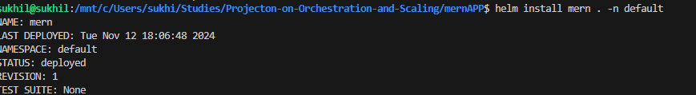
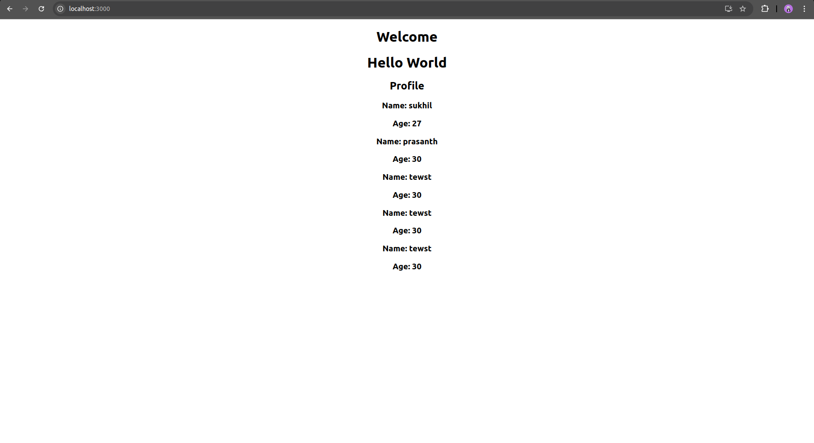

# Deploy a MERN Application using Azure Kubernetes Service (AKS)
This document provides a step-by-step guide for deploying a MERN stack application on Azure Kubernetes Service (AKS). It outlines all necessary steps, from setting up the environment to deploying the application. Additionally, the README includes instructions on how to configure the necessary files, tools, and resources for deployment, along with relevant screenshots and images that will guide you through the process.

---
## Table of Contents
1. Prerequisites
2. Setting Up Azure Kubernetes Service (AKS)
3. Clone the Repository
4. Configure Kubernetes Resources
5. Build Docker Images
6. Deploy to AKS
7. Access the Application
8. Screenshots
9. Conclusion

### Prerequisites
Before you begin, ensure you have the following prerequisites:

- Azure Account: You must have an Azure account. If you don’t have one, sign up for a free account here.
- Azure CLI: Install the Azure CLI for interacting with Azure resources via the command line. Installation guide.
- Kubernetes CLI (kubectl): Install kubectl to interact with your AKS cluster. Installation guide.
- Docker: Install Docker to build and push Docker images. Installation guide.
- Node.js & npm: Ensure that you have Node.js and npm installed for building the MERN stack application locally. Installation guide.
- Git: Install Git to clone the repository. Installation guide.

### Setting Up Azure Kubernetes Service (AKS)
Follow these steps to create and set up an AKS cluster:

- Create Resource Group: In the Azure CLI, run the following command to create a resource group:

```bash
az group create --name <your-resource-group> --location eastus
```
- Create AKS Cluster: Next, create an AKS cluster in the resource group:
```bash
az aks create --resource-group <your-resource-group> --name <aks-cluster-name> --node-count 3 --enable-addons monitoring --generate-ssh-keys --node-vm-size<Node-size>
```
- Connect to the AKS Cluster: Once the cluster is created, configure kubectl to interact with your AKS cluster:
```bash
az aks get-credentials --resource-group <your-resource-group> --name <aks-cluster-name>
```
- Verify the connection to the cluster:
```bash
kubectl get nodes
```


### Clone the Repository
- Clone the MERN application repository:
```bash
git clone https://github.com/UnpredictablePrashant/SampleMERNwithMicroservices.git
```

- Navigate into the project directory:
```bash
cd SampleMERNwithMicroservices
```
### Build Docker Images
- Build  Docker Image:
```bash
docker build -t <your-dockerhub-username>/mern:latest .
```
- Push the Images to Docker Hub:

    - Log in to Docker Hub:
```bash
docker login
```
- Push the frontend and backend images:
```bash
docker push <your-dockerhub-username>/mern:latest
```
### Deploy to AKS
- Create Kubernetes Deployments:

    - Deploy your frontend and backend services using the following command:
```bash
cd mernAPP
helm install simple-mern . -n default
```



### Access the Application
- Once the services are deployed, you can access the application using the port forwarding.

    - Get service name:

    Run the following command to get the service name of your frontend service:
```bash
kubectl get services
```

It will display the frontend service, Portforward it and Access the Application:
```bash
kubectl port-forward svc/<frontend service name> 3000:3000
```

Open a browser and navigate to http://localhost to access the frontend.




### Conclusion
You have successfully deployed a MERN stack application on Azure Kubernetes Service (AKS). This deployment provides a scalable, reliable environment for your application and takes advantage of the powerful features of AKS, such as auto-scaling and monitoring. 

### Notes:
- Ensure you provide appropriate images at the relevant sections where the guide instructs.
- Replace placeholder ```<docker-image-name>```, ```<your-dockerhub-username>```, and ```<aks-cluster-name>``` with the actual values you use in your deployment process.